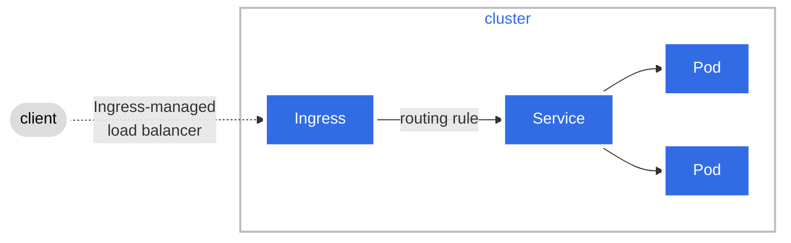

# Orchestrator
The `Orchestrator` package represents a component in charge of managing a single cluster. In order to do that, this component exposes a
set of interfaces that are used as subcomponents for managing different resources in a cluster.

## Cluster
The `Cluster` interface grants you access to the different interfaces available to manage resources. 

## Nodes
The `Nodes` interface allows you to manage nodes. Nodes are a representation of a machine that's running inside the 
cluster. As it is right now, this interface exposes a method to wait until 
nodes have joined the cluster and are ready to be used.

## Pods
The `Pods` interface allows you to manage pods. Pods are a representation of a Unit of Work running inside 
different Nodes. 
- Pods can be created by passing a `CreatePodInput` instance to the `Create` method.
- Scripts and commands can be executed inside a Pod by using the `Executor`.
- Files and logs can be read from a running Pod by using the `Reader`.
- As well as the `Nodes` interface, the `Pods` interface exposes a method to wait for a certain condition to happen.
- Pods can be deleted by using the `Delete` method.

## Services
The `Services` interface allows you to manage services. Services are an abstraction which defines a policy by on how to 
access `Pods`. 
- Services can be created by passing a `CreateServiceInput` instance to the `Create` method.
- Services can be removed by using the `Delete` method.

## Ingresses
The `Ingresses` interface allows you to manage ingresses. An Ingress exposes HTTP and HTTPS routes from outside the 
cluster to services within the cluster.

Two different implementations were create for Cloudsim, one using the default Kubernetes Ingress implementation, and 
another one using a third-party application called Gloo.

From Glooo's documentation:
> Gloo is a feature-rich, Kubernetes-native ingress controller, and next-generation API gateway. 
> Gloo is exceptional in its function-level routing; its support for legacy apps, microservices and serverless; 
> its discovery capabilities; its numerous features; and its tight integration with leading open-source projects.

A table has been added below to help you understand how these two implementations compare to each other by the 
implementation-specific resource they consume:

| Component | Kubernetes | Gloo |
| ----- | ----- | ----- |
| Ingresses | Ingress | Virtual Services |
| IngressRules | IngressRule | Virtual Host |
| Rule | HTTPIngressRuleValue | Route |
| Path | HTTPIngressPath | RouteAction + Matcher |

## Ingress Rules

### Paths